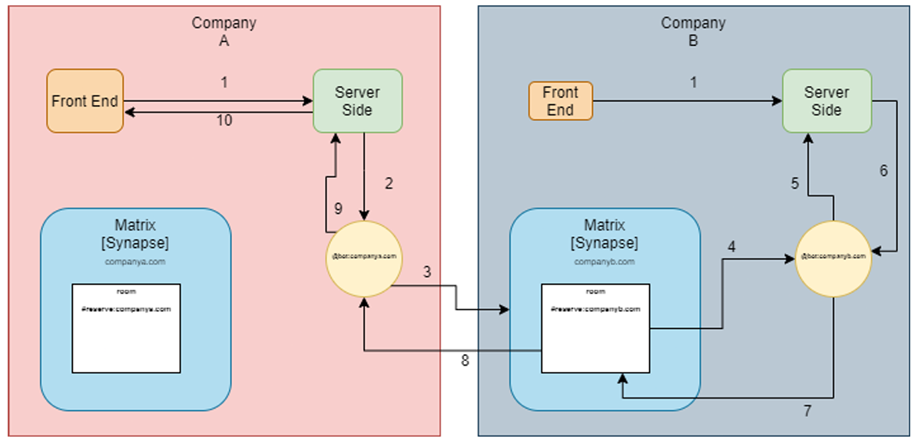

# Meeting Room Booking System

## Project Overview

This repository contains the work developed for the Meeting Room Booking System, created as part of the Project IV curricular unit in the 3rd year of the Graduation Degree in Informatics Engineering at the School of Technology and Management of the Polytechnique Institute of Viana do Castelo.

The main goal was to develop a web platform for booking room reservations and to enhance it with smart features, including an Artificial Intelligence system and decentralization capabilities. Significant progress was made in various areas including AI-driven recommendations and decentralization.

## Project Features

- **Web Platform for Room Booking**: A comprehensive system to manage room reservations.
- **AI Integration**: An AI-driven recommendation system to enhance user experience using Python, Flask, and Scikit-learn.
- **Decentralization**: Implementation of a decentralized booking system via Matrix.
- **TypeScript Migration**: Migrated to TypeScript to improve scalability and facilitate large-scale development.
- **Scheduled Tasks**: Cron jobs for automating system maintenance and updates.

## Technologies Used

- **Front-end**: HTML, CSS, JavaScript
- **Back-end**: Node.js, Express.js, Python, Flask
- **Database**: PostgreSQL
- **Communication Architecture**: Matrix
- **AI & Machine Learning**: Scikit-learn
- **Scheduling**: Cron
- **Testing**: Jest
- **Documentation**: Insomnia Documenter

## Project Images

### User Interface

*Figure 1: Screenshot of the User Interface.*

*Figure 2: Screenshot of the User Interface.*

### System Architecture

*Figure 3: Diagram of the System Architecture.*

*Figure 4: Diagram of the matrix Architecture.*

### Recommendation System Flow

*Figure 5: Diagram of the Recommendation Flow.*

## Contributors

- **João Vieira**
- **José Ferreira**

### Supervisors

- **Professor Doutor Jorge Ribeiro**
- **Eng. Hélder Ferreira**

## License

This project is licensed under a Non-Utilization License. The contents of this repository are not intended for any form of commercial or non-commercial use. Please contact the contributors for more information.
